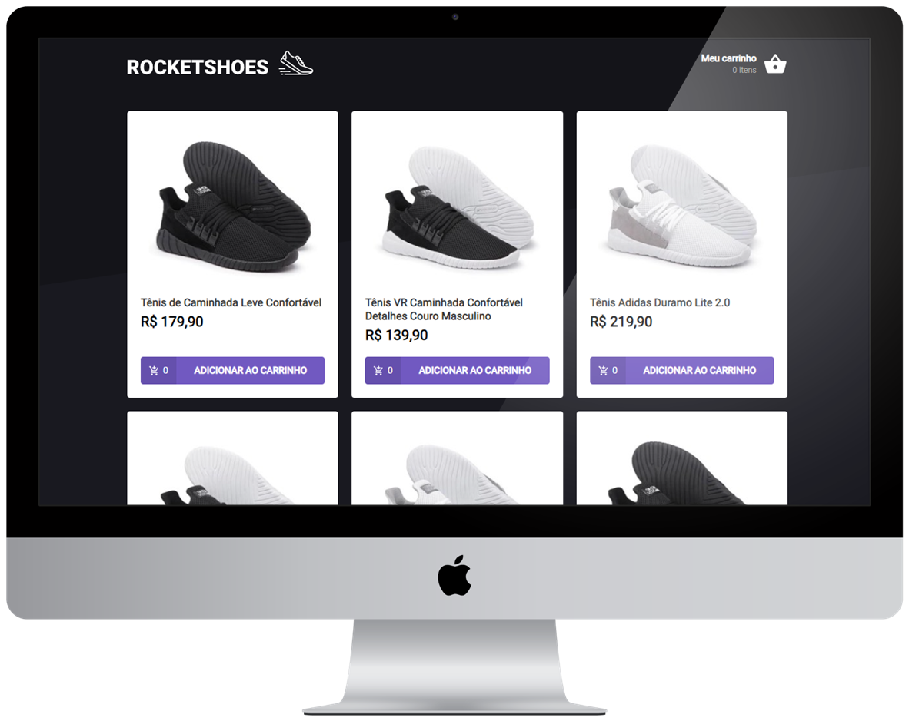

<h1 align="center">
         
</h1>

<p align="center">
  <a href="#-projeto">Projeto</a>&nbsp;&nbsp;&nbsp;|&nbsp;&nbsp;&nbsp;
  <a href="#-ambiente">Ambiente</a>&nbsp;&nbsp;&nbsp;|&nbsp;&nbsp;&nbsp;
  <a href="#%EF%B8%8F-license">License</a>&nbsp;&nbsp;&nbsp;
</p>

<br>

<p align="center">
    
     
</p>

<br>

<p align="center">
 
</p>

<br>

## 💻 Projeto
<hr>

Terceiro desafio realizado no curso Ignite da [Rocketseat](https://rocketseat.com.br/).

Desafio: 

- Adicionar um novo produto ao carrinho;
- Remover um produto do carrinho;
- Alterar a quantidade de um produto no carrinho;
- Cálculo dos preços sub-total e total do carrinho;
- Validação de estoque;
- Exibição de mensagens de erro;
- Entre outros.

Após clonar o template, era necessário completar os códigos dos seguintes documentos:

- src/components/Header/index.tsx
- src/pages/Home/index.tsx
- src/pages/Cart/index.tsx
- src/hooks/useCart.tsx

> Neste projeto foi possível usar o toastify para mostrar erros de forma rápida e bonita.
> Foi usado a API localStorage para persistir dados no navegador.
> Conheci JSON server com o intuito de simular uma API.

<br>

## 📝 Ambiente
<hr>

1. Clonar o repositório:

```bash
git@github.com:CaioLemec/hook-carrinho-de-compras.git
```

2. Instale as dependências usando o comando:

```bash
 yarn
```

3. No seu terminal execute o comando para rodar o server:

```bash
yarn server
```

3. Abra outro terminal e execute o comando para rodar a aplicação:

```bash
yarn dev
```

4. acesse o endereço em um browser compatível:

```bash
http://localhost:3000/
```
<br>

## ⚖️ License
<hr>

Projeto licenciado por MIT [LICENSE](./LICENSE).
